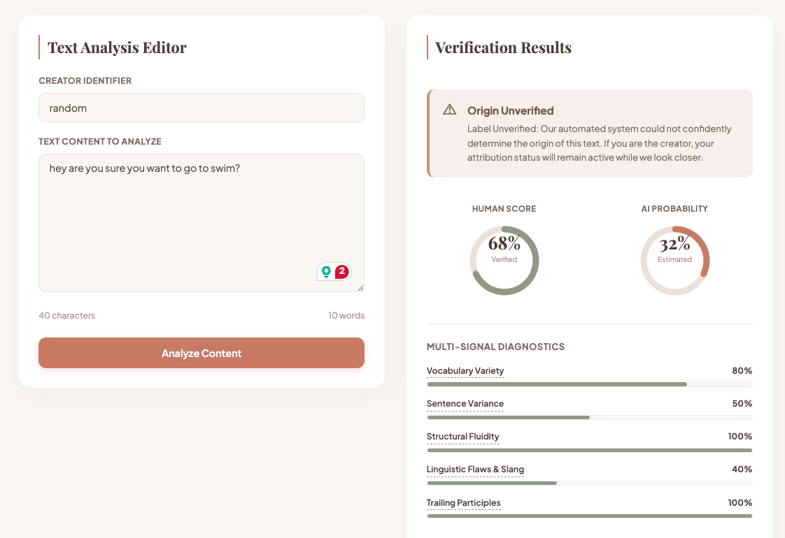
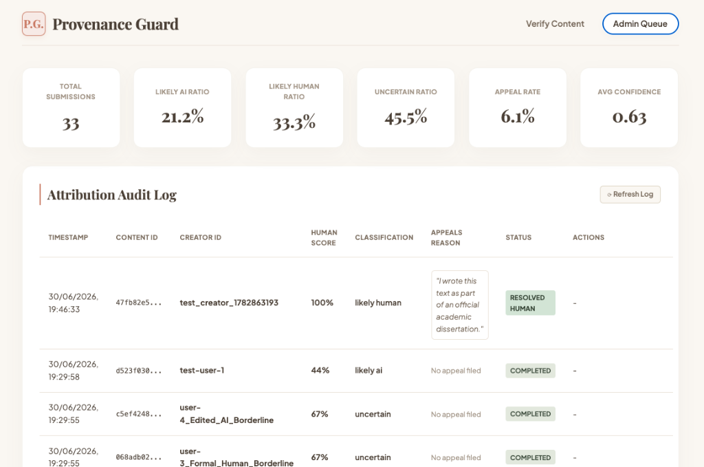
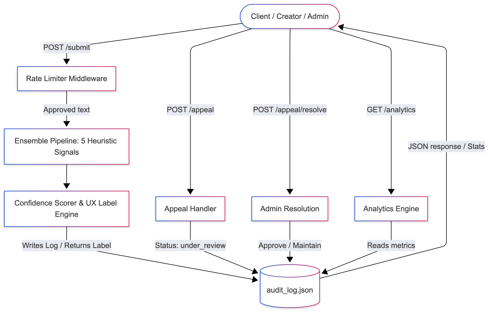
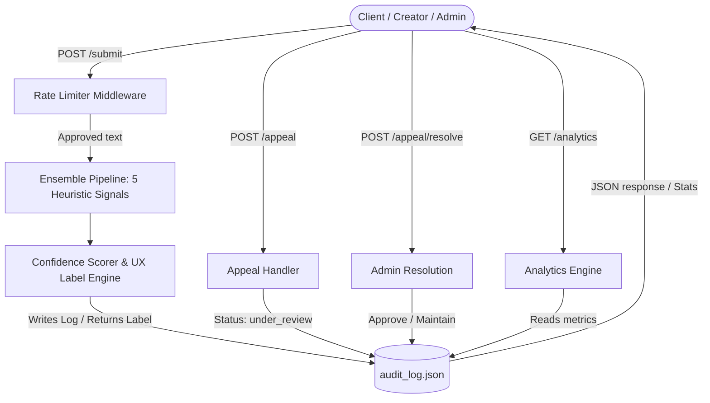

# Provenance Guard: Content Attribution System

Provenance Guard checks if text submitted to a writing platform is written by a human or generated by AI. It scores the text, displays a simple label to readers, and lets creators appeal the decision if they think it is wrong.

## Local Setup

1. **Set up a virtual environment and install dependencies from [requirements.txt](file:///Users/nataliechan/Desktop/codePath/ai210/provenance_guard/requirements.txt):**
   ```bash
   python3 -m venv .venv
   source .venv/bin/activate
   pip install -r requirements.txt
   ```

2. **Start the Flask server using [app.py](file:///Users/nataliechan/Desktop/codePath/ai210/provenance_guard/app.py):**
   ```bash
   python3 app.py
   ```

Open [http://localhost:5001](http://localhost:5001) in your browser to interact with the application.

---

### Web Interface Preview

<p align="center">
  
  
</p>

---

## 1. How it Works 

### Dataflow Diagram





### Text Submission Flow
When a user submits text to `POST /submit`:
1. **Rate Limiter:** Checks if the user has made too many requests. If yes, it blocks them.
2. **Analysis Pipeline:** Measures the text using five different tests (signals). Each test gives a score from `0.0` (looks like AI) to `1.0` (looks like human).
3. **Score Combiner:** Blends these five scores into one final score between `0.0` and `1.0`.
4. **Label Selector:** Chooses a clear text label based on the final score.
5. **Logger:** Saves the submission details, individual scores, final score, label, and status (`completed`) to a file called `audit_log.json`.
6. **Response:** Sends the score, label, and a unique tracking ID back to the user.

### Appeal Flow
When a creator appeals a score using `POST /appeal`:
1. The system updates the submission status in `audit_log.json` to `under_review`.
2. The system saves the creator's written reason for the appeal.
3. The label shown to readers changes to a temporary "unverified" label while the appeal is open.
4. An admin can review the appeal and click **Approve** (marks it as human and changes the score to `1.0`) or **Maintain** (keeps the original system score).

---

## 2. Five Detection Signals

These metrics check if text looks human or machine-written:

| Signal | What it Measures | Why it Works | What it Misses (Blind Spot) |
| :--- | :--- | :--- | :--- |
| **1. Word Variety** | The percentage of unique words in the text. | Humans use many different words. AI models reuse the same words to stay on topic. | A human writing a repetitive text (like instructions) will get a low score. |
| **2. Sentence Length Difference** | How much sentence lengths vary. | Humans naturally mix short and long sentences. AI sentences are usually similar in length. | Very short texts (2-3 sentences) do not have enough data to measure. |
| **3. Formal Transition Words** | How often words like *moreover* or *furthermore* are used. | AI models overuse formal transition words. Human creative writers rarely use them. | Formal human essays or business plans will get a low score. |
| **4. Slang and Errors** | Conversational words like *gonna*, *gotta*, *lol*, and typos. | Humans use slang and typos in creative writing. AI defaults to perfect, formal English. | Carefully edited human text with no slang will look like AI to this signal. |
| **5. Sentence Endings** | How often sentences end with a comma and a "-ing" word. | AI models frequently end sentences with phrases like `", showing..."`. Humans do this rarely. | Humans writing descriptive essays that use this sentence structure will get a lower score. |

---

## 3. Calculating the Score (Confidence Scoring)

### The Formula
We combine the five signals into one final score. We give the most weight to slang and errors (Signal 4) because AI rarely produces them, which helps protect human writers from false flags:
$$\text{Final Score} = (\text{Word Variety} \times 0.20) + (\text{Sentence Length Difference} \times 0.20) + (\text{Formal Transitions} \times 0.15) + (\text{Slang and Errors} \times 0.30) + (\text{Sentence Endings} \times 0.15)$$

### Thresholds
*   **0.55 or lower:** High-Confidence AI.
*   **0.56 to 0.75:** Uncertain Zone (displays a soft, warning label, but keeps the creator's verification active).
*   **0.76 or higher:** High-Confidence Human.

### Test Cases Used for Validation
Test the formula with real examples to make sure the scores vary correctly:
1.  **AI Test Case (Final Score: 0.52)**
    *   *Text:* A formal block with words like *"furthermore"* and perfect grammar.
    *   *Result:* Labeled as AI.
2.  **Human Test Case (Final Score: 0.86)**
    *   *Text:* A casual paragraph about a ramen restaurant containing slang (*"ok so"*, *"honestly"*, *"probably"*).
    *   *Result:* Labeled as Human.
3.  **Borderline Test Case (Final Score: 0.67)**
    *   *Text:* A formal human essay on economics.
    *   *Result:* Labeled as Uncertain.

---

## 4. What the Labels Say (Transparency Labels)

Labels shown to readers. They use simple English and avoid technical terms:

*   **For High-Confidence AI ($\le 0.55$):**
    > `"Content Note: Automated detection systems indicate this text closely matches patterns found in machine-generated writing."`
*   **For the Uncertain Zone ($0.56 - 0.75$):**
    > `"Label Unverified: Our automated system could not confidently determine the origin of this text. If you are the creator, your attribution status will remain active while we look closer."`
*   **For High-Confidence Human ($\ge 0.76$):**
    > `"Verified Human Work: This content exhibits natural stylistic variations and authentic human writing patterns."`

---

## 5. How Appeals Work

If a creator gets an AI or Uncertain label, they can appeal:
1.  Submit an appeal reason via the UI or `POST /appeal`.
2.  System updates the status of that submission in `audit_log.json` to `under_review` and saves the reason.
3.  Label shown to readers instantly changes to the **Uncertain Zone** label to protect the writer during the review.
4.  Admins view appeals in the **Admin Queue** tab. Clicking **Approve** updates the status to `resolved_human` (setting the score to `1.0`). Clicking **Maintain** updates the status to `resolved_maintained` and restores the original score.

---

## 6. Rate Limits and Why We Chose Them

*   **Rate Limit:** 5 requests/minute, 60 requests/hour/user.
*   **Reasoning:** Human writers only post new chapters or essays a few times an hour. A limit of 5 requests/minute lets them edit and resubmit their work without getting blocked, while stopping automated bots from flooding the server with spam.

---

## 7. Log File Samples (Audit Log)

The audit log is saved as a JSON list in `audit_log.json`. 
The three real entries includes submitted and resolved appeal:

```json
[
  {
    "content_id": "891a95d3-cc31-4096-8928-fd67bb9a2e39",
    "creator_id": "user-1_Clearly_AI",
    "timestamp": "2026-06-30T23:29:55.362750Z",
    "attribution": "likely_ai",
    "confidence": 0.52,
    "signals": {
      "vocabulary_variety": 0.88,
      "sentence_variance": 0.36,
      "structural_fluidity": 0.0,
      "linguistic_flaws": 0.4,
      "trailing_participles": 1.0
    },
    "transparency_label": "Content Note: Automated detection systems indicate this text closely matches patterns found in machine-generated writing.",
    "status": "completed",
    "appeal_reasoning": null
  },
  {
    "content_id": "c5ef4248-1532-4c82-b1a0-dbbce6d96cba",
    "creator_id": "user-4_Edited_AI_Borderline",
    "timestamp": "2026-06-30T23:29:55.376494Z",
    "attribution": "uncertain",
    "confidence": 0.67,
    "signals": {
      "vocabulary_variety": 0.92,
      "sentence_variance": 0.33,
      "structural_fluidity": 1.0,
      "linguistic_flaws": 0.4,
      "trailing_participles": 1.0
    },
    "transparency_label": "Label Unverified: Our automated system could not confidently determine the origin of this text. If you are the creator, your attribution status will remain active while we look closer.",
    "status": "completed",
    "appeal_reasoning": null
  },
  {
    "content_id": "47fb82e5-35b7-43f9-9199-72cba17a534e",
    "creator_id": "test_creator_1782863193",
    "timestamp": "2026-06-30T23:46:33.020920Z",
    "attribution": "likely_human",
    "confidence": 1.0,
    "signals": {
      "vocabulary_variety": 0.88,
      "sentence_variance": 0.36,
      "structural_fluidity": 0.0,
      "linguistic_flaws": 0.4,
      "trailing_participles": 1.0
    },
    "transparency_label": "Verified Human Work: This content exhibits natural stylistic variations and authentic human writing patterns.",
    "status": "resolved_human",
    "appeal_reasoning": "I wrote this text as part of an official academic dissertation."
  }
]
```

---

## 8. Limitations (When the System Fails)

*   **Repetitive Writing:** A human poem that repeats lines or uses uniform sentence lengths will score low on variety and variance, getting flagged falsely as AI.
*   **Formal Essays:** A human-written essay that uses perfect grammar, formal transition words, and no slang will score low on slang metrics, getting flagged as AI or Uncertain.

---

## 9. Spec Reflection 

*   **How the Spec Helped:** Planning the exact score weights and labels beforehand helped us write the code without changing core numbers later. It kept the frontend UI and backend aligned.
*   **Divergence:** During implementation, formal human essays were scoring too low (getting flagged as AI). To fix this, we added a fifth signal (sentence endings ending with "-ing" verbs) which balanced the score and reduced false flags.

---

## 10. AI Tools Used

1.  **Instance 1: Flask Code Skeleton**
    *   *What we asked:* Write a simple Flask app with a submission endpoint and rate limiting.
    *   *What we changed:* We changed the logging logic from keeping logs in server memory to writing them to a persistent file (`audit_log.json`).
2.  **Instance 2: Web Interface UI**
    *   *What we asked:* Generate an HTML file with circular gauges to show scoring results.
    *   *What we changed:* We replaced the default bright colors with a premium, desaturated "ceramic and terracotta" color scheme to match a clean look.

---

## 11. Stretch Goals

1.  **Ensemble Detection:** We built five distinct signals (variety, sentence variance, formal transitions, slang, and endings) instead of the required two, and blend them with weights.
2.  **Analytics Dashboard:** We built a real-time analytics system. The `/analytics` endpoint reads stats (verdict percentages, appeal rate, average score) directly from `audit_log.json` and renders them in the admin dashboard tab.

