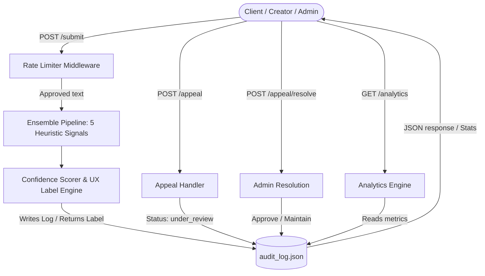

# Provenance Guard  - Planning & Architecture

This document maps out the system architecture, core detection engine logic, and API contracts for the backend system.

---

## Architecture



### Architecture Narrative
When a user submits text for evaluation, the data travels through a single pipeline:

1. **Rate Limiter Middleware:** The system checks how often the user or client has made requests. If the request volume is within safe bounds, the text passes forward. If not, it blocks the request immediately to prevent spam.
2. **Multi-Signal Detection Pipeline:** The raw text enters the classification engine. The engine runs the text through five independent analysis modules (Vocabulary Variety, Sentence Length Variance, Structural Fluidity, Linguistic Flaws, and Trailing Participles). Each module produces an individual mathematical score.
3. **Confidence Scorer:** This module takes the individual scores and processes them into a single confidence rating between 0.0 and 1.0. The math intentionally favors human creators to avoid false accusations.
4. **UX Label Engine:** The system converts the final numerical confidence rating into plain, empathetic English text. This step ensures non-technical users can easily understand the decision status.
5. **Audit Logger:** The system creates a permanent record containing the submission ID, a snippet of the text, individual signal scores, the final classification, and the current status.
6. **API Router Response:** The backend returns a structured JSON payload to the user containing the tracking ID, score, and user-facing text label.

---

## Detection Signals

Each signal will analyze incoming text and return a calibrated float score between `0.0` (indicates high probability of AI generation) and `1.0` (indicates high probability of Human origin). 

The individual scores are combined using a weighted average. Because the false positive rate of any individual heuristic is high, we place heavier weight on indicators of human style (Signal 4: Slang/Flaws) to actively pull scores away from false AI classifications.

### Signal 1: Vocabulary Variety 
* **What it measures:** The percentage of unique words used compared to the total number of words in the text.
* **Why it works:** Human writers naturally use a varied vocabulary, mixing in descriptive words and random word choices when crafting prose. AI models tend to pick mathematically optimal words repeatedly to stay strictly focused on a topic.
* **Blind Spot:** If a human writes a technical manual, instructional guide, or repetitive chant, the variety score drops drastically, and the tool might mistake it for AI text.
* *Output:* A float value between `0.0` and `1.0`. Calculated as (Unique Words / Total Words).
* *Weight:* 25% of the total confidence calculation.

### Signal 2: Sentence Length Variance 
* **What it measures:** The mathematical variance in sentence lengths across the entire document.
* **Why it works:** Humans naturally mix short, sharp sentences with long, winding ideas. This variation creates a rhythmic "burstiness." AI models write text using highly predictable, uniform sentence lengths to keep readability scores stable.
* **Blind Spot:** Very short texts (such as a 3-sentence poem or a short social media post) do not have enough sentences to establish an accurate variance measurement.
* *Output:* A float value between `0.0` and `1.0`. Calculated via standard deviation of sentence lengths, capped and normalized against a 30-word variance benchmark.
* *Weight:* 25% of the total confidence calculation.

### Signal 3: Structural Fluidity & Transitions 
* **What it measures:** The density of formal transition words (*Moreover, Furthermore, Additionally*) and complex punctuation (*em-dashes, semicolons*).
* **Why it works:** AI models write with calculated smoothness. They frequently rely on predictable introductory phrases or clean complex punctuation to link ideas. Humans rarely use these formal transition words repetitively in casual writing.
* **Blind Spot:** A highly academic human essay or a formal business proposal uses these transitions and could trigger a false AI rating.
* *Output:* A float value between `0.0` and `1.0`. Counts AI markers like "Moreover" or "Furthermore". A high keyword density drives the score closer to `0.0`.
* *Weight:* 20% of the total confidence calculation.

### Signal 4: Linguistic Flaws & Informal Slang 
* **What it measures:** The presence of conversational contractions (*gonna, gotta*), text abbreviations, or minor grammatical slip-ups.
* **Why it works:** Human creative writing is filled with conversational character speech, stylistic choices, and occasional typos. AI text defaults to grammatically flawless prose, avoids casual slang unless heavily prompted. 
* **Blind Spot:** A polished piece of edited human fiction might have all slang and typos removed, making it look more like AI text to this specific signal.
* *Output:* A float value between `0.0` and `1.0`. Counts conversational slang ("gonna", "gotta") and simple typographical patterns. High presence drives the score straight to `1.0`.
* *Weight:* 30% of the total confidence calculation.
### Signal 5: Trailing Participle Modifiers (Superficial Analysis)
* **What it measures:** The density of sentences that end with a comma followed by a present participle ("-ing" word) phrase (e.g., `", highlighting..."`, `", indicating..."`, `", making it..."`).
* **Why it works:** AI models tend to construct long sentences that append superficial analysis or consequences at the end of sentences using trailing participle clauses. Humans write with more varied sentence endings (using prepositions, simple periods, or coordinate clauses).
* **Blind Spot:** Some academic or formal human writing also uses trailing participle modifiers, which could result in a lower score (more AI-like) for that specific signal.
* *Output:* A float value between `0.0` and `1.0`. Evaluates if sentences end with a comma followed by a present participle; high density of trailing participles drives the score closer to `0.0`.
* *Weight:* 15% of the total confidence calculation.


**Scoring Equation Formula (Ensemble Detection - 5 Signals):**
`Final Confidence Score = (Score1 * 0.20) + (Score2 * 0.20) + (Score3 * 0.15) + (Score4 * 0.30) + (Score5 * 0.15)`

---

## False Positive Management

Labeling a human creator's original work as AI-generated damages user trust deeply. The system uses three layers of defense to protect human writers:

1. **Uncertainty Buffer:** If the confidence scoring engine falls into a borderline zone (such as 0.50 to 0.65), the system automatically categorizes the text into an "Uncertain" bucket rather than confidently labeling it as AI.
2. **Empathetic Labeling:** Instead of displaying an aggressive warning, the system displays a soft, clear label that invites collaboration: *"We couldn't verify the origin of this text automatically. If you wrote this, please let us know so we can keep our system fair."*
3. **Seamless Appeal Path:** The creator can submit an appeal request right away. The system instantly flags the database entry as `under_review`, preserving the creator's standing while a human moderator reviews the case.

---

## Uncertainty & Transparency Label Design

Our score limits protect human creators by establishing a broad uncertainty buffer zone. Scores are classified across three precise ranges:

### 1. Score Threshold Matrix
* **Score Range [0.00 to 0.55]: High-Confidence AI**
    * *System Meaning:* The text completely lacks natural/organic sentence structure variety, uses hyper-polished grammar, contains heavy transitions, and no conversational slang.
    * *Verbatim Transparency Label:* `"Content Note: Automated detection systems indicate this text closely matches patterns found in machine-generated writing."`
* **Score Range [0.56 to 0.75]: Uncertain Zone**
    * *System Meaning:* The text features an inconsistent mix of rigid structures and unique vocabulary choices, resulting in an unclear origin reading.
    * *Verbatim Transparency Label:* `"Label Unverified: Our automated system could not confidently determine the origin of this text. If you are the creator, your attribution status will remain active while we look closer."`
* **Score Range [0.76 to 1.00]: High-Confidence Human**
    * *System Meaning:* The text displays clear rhythmic variation, informal phrasing, and a highly organic word diversity footprint.
    * *Verbatim Transparency Label:* `"Verified Human Work: This content exhibits natural stylistic variations and authentic human writing patterns."`

---


## Appeals Workflow

* **Who can appeal:** Any verified user who receives "High-Confidence AI" or "Uncertain Zone" system label on their submitted work.
* **Data Captured:** The submission tracking ID, the user's plain-text explanation reasoning, and a timestamp.
* **System Side Effects:** The entry status in the persistent log updates immediately from `"completed"` to `"under_review"`. The content's classification is preserved as-is, but the active label displayed to audiences switches to the unverified-label placeholder text.
* **Human Reviewer Queue Schema:** A platform administrator opening the queue sees a clean dashboard tracking table displaying:
    * `Submission ID` | `Original Score` | `Flagged Category` | `Creator Reason Message` | `Action Buttons (Approve Human / Maintain System Label)`


---

## Anticipated Edge Cases

1.  **Repetitive Avant-Garde Poetry:** A human-written poem use heavy repetition of a strict, five-word stanza structure. This deliberate creative choice drops the Vocabulary Variety (Signal 1) and Sentence Length Variance (Signal 2) sub-scores close to zero, causing an erroneous AI flag.
2.  **Academic Medical Journal Excerpts:** A human researcher write a formal medical abstract. The piece contains transitional phrases ("Furthermore", "Additionally"), perfect punctuation compliance, and zero informal slang terms, causing the system to score it falsely as machine-generated text.

---

## API Endpoints

### 1. Content Submission
* **Endpoint:** `POST /submit`
* **Request Body:**
```json
{
  "content": "Once upon a time, a human writer sat down to create a story..."
}
```
* **Response Body (200 OK):**
```
{
  "content_id": "sub_102938475",
  "creator_id": "user-123",
  "attribution": "likely_human",
  "confidence_score": 0.88,
  "individual_signals": {
    "vocabulary_variety": 0.85,
    "sentence_variance": 0.91,
    "structural_fluidity": 1.0,
    "linguistic_flaws": 0.75,
    "trailing_participles": 0.90
  },
  "transparency_label": "Verified Human Work: This content exhibits natural stylistic variations and authentic human writing patterns.",
  "status": "completed"
}
```


### 2. Sunmit Appeal
* **Endpoint:** `POST /appeal`
* **Request Body:**
```json
{
  "submission_id": "sub_102938475",
  "reason": "This text is an excerpt from my handwritten personal journal."
}
```
* **Response Body (200 OK):**
```
{
  "submission_id": "sub_102938475",
  "status": "under_review",
  "message": "Your appeal has been received. A team member will review it shortly."
}
```


### 3. View Audit Log
* **Endpoint:** `GET /log`
* **Request Body:** `None`
* **Response Body (200 OK):**
```
{
  "entries": [
    {
      "content_id": "sub_102938475",
      "creator_id": "user-123",
      "timestamp": "2026-06-29T20:12:17Z",
      "attribution": "likely_human",
      "confidence": 0.88,
      "signals": {
        "vocabulary_variety": 0.85,
        "sentence_variance": 0.91,
        "structural_fluidity": 1.0,
        "linguistic_flaws": 0.75,
        "trailing_participles": 0.90
      },
      "transparency_label": "Verified Human Work: This content exhibits natural stylistic variations and authentic human writing patterns.",
      "status": "under_review",
      "appeal_reasoning": "This text is an excerpt from my handwritten personal journal."
    }
  ]
}
```


### 4. View Analytics Dashboard
* **Endpoint:** `GET /analytics`
* **Request Body:** `None`
* **Response Body (200 OK):**
```
{
  "total_submissions_processed": 1,
  "detection_pattern_ratios": {
    "likely_ai_percentage": 0.0,
    "likely_human_percentage": 100.0,
    "uncertain_percentage": 0.0
  },
  "appeal_rate_percentage": 100.0,
  "average_system_confidence_score": 0.88
}
```

---

## AI Tool Plan

### Milestone 3: API Framework & First Evaluation Heuristic
* **Context Sections Provided:** `## Architecture Diagram & Flows` + `## Detection Signals (Signal 1 Details)`
* **Generation Target Request:** A clean Python Flask/FastAPI application framework containing the `POST /submit` endpoint and the companion python calculation logic for processing Vocabulary Variety token inputs.
* **Verification Strategy:** Execute manual requests targeting the submission endpoint using a 10-word repetitive block and a 100-word diverse essay block to verify the custom sub-score calculation shifts expected ratios.

### Milestone 4: Parallel Pipeline Expansion & Weighted Score Blending
* **Context Sections Provided:** `## Architecture Diagram & Flows` + `## Detection Signals (All 4 Signals)` + `## Uncertainty & Transparency Label Design`
* **Generation Target Request:** Integration of the 3 remaining helper signal evaluation algorithms along with the unified linear equation algorithm execution to aggregate individual outputs.
* **Verification Strategy:** Pass known AI generated content fragments and authentic messy conversational texts to confirm the calculated metric outputs accurately partition cleanly across the threshold bounds.

### Milestone 5: UI Output Formatting & Appeals Queue Tracking
* **Context Sections Provided:** `## Uncertainty & Transparency Label Design` + `## API Endpoints` + `## Appeals Workflow`
* **Generation Target Request:** The `POST /api/v1/appeal` handler mechanism, label lookup assignment dictionary mapping structures, and the raw text file append logging utilities.
* **Verification Strategy:** Query the `GET /api/v1/log` endpoint after processing entries to guarantee the audit dictionary registers submission metadata and confirms the state value successfully converts to `"under_review"` following a client appeal trigger.